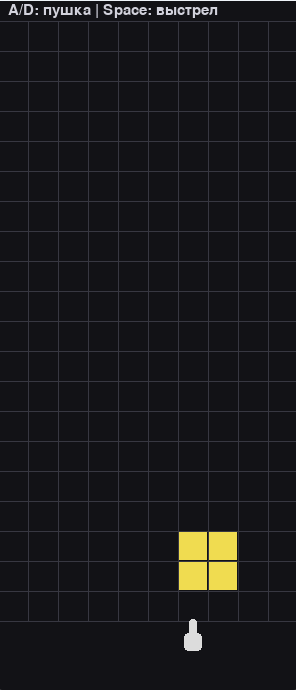
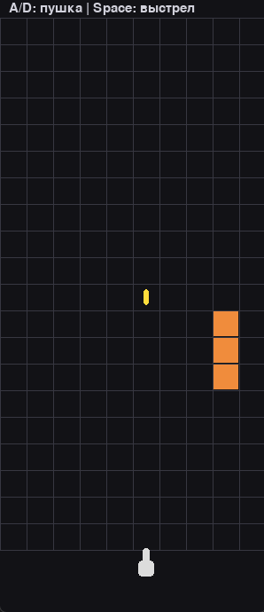

# BlockDefenseGame
## Тетрис-защита
Сверху падают блоки разной формы. Игрок в Pygame управляет пушкой снизу, которая стреляет по блокам. Попадание разрушает блок на отдельные кубики. Цель - не дать блокам составить сплошную линию на полу.
---
## Стек технологий
- **Python 3.14**
- **Pygame-ce 2.5.8** - графический движок, обработка ввода и отрисовка
---
## Структура проекта
```
BlockDefenseGame/py_block_defense/
├── main.py   # Точка входа в приложение
├── _init_.py # Документация пакета
```
## Запуск игры
Запуск из папки `BlockDefenseGame/py_block_defense/`:
```bash
cd BlockDefenseGame/py_block_defense/
python3 main.py
```
---
## Управление
| Клавиша | Действие |
|---------|----------|
| `A` `D` | Перемещение пушки |
| `Space` | Выстрел |
| `Закрыть окно` | Выход из игры |
---
## Интерфейс
Отображается стакан 10x20 с падающей фигурой и пушкой снизу.
## Скриншоты

Основной экран: сетка стакана 10x20, падающий блок и пушка.

Удаление сегмента падающего блока.
## Зависимости
Убедитесь, что установлен Python 3.14+ и Pygame-ce 2.5.8:
```bash
pip list
```
Если Pygame не установлен:
```bash
pip install pygame-ce
```
